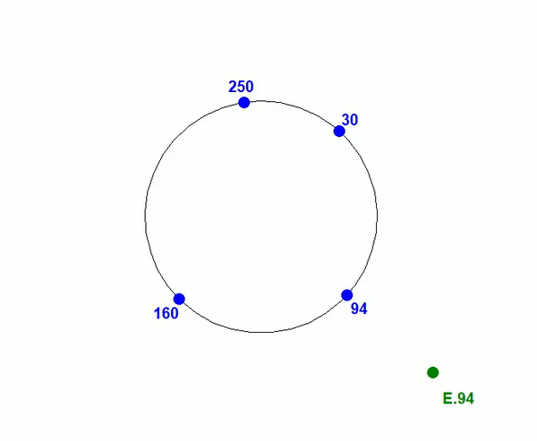

# ChordDrawer
Afficheur de l'activité sur un réseau Chord (TP SD)




## Utilisation comme submodule

### Pour l'ajouter a votre repo:

```bash
git submodule add git@github.com:FoxtrotNSF/ChordDrawer.git
```

### Pour le mettre a jour:

```bash
git submodule update --remote
```

## Utilisation / Prérequis
### Dans le fichier `chord_tools.py`:
  - Importer le module: (Par exemple si le module est dans le dossier ChordDrawer)
  ```python
  from ChordDrawer.chord_drawer import *
  ```
  - Décorer la fonction json_send
  ```python
  @draw_activity
  def json_send(ip, port, data):
    ...
  ```
### Dans votre noeud chord (a l'initialisation du noeud, avant la boucle de reception)
  - Configurer le notifieur associé au noeud
  ```python
  notifier.configure_node([votre_ip],[port_du_noeud])
  ```
  - Pour enregistrer le premier Noeud a rejoindre le réseau (seulement le premier Noeud)
  ```python
  notifier.notify_first_node([votre_ip],[port_du_noeud],[cle_du_noeud])
  ```
  
## Configuration
  Le Drawer doit connaître le nombre de clés disponibles dans le réseau Chord
  
  Il est configuré pour s'executer sur un port donné
  
  Pour un Drawer présent sur une autre machine, il est necessaire de configurer aussi son ip
  
## Fonctionnement
Chaque Noeud est associé à un notifieur, qui intercepte les signaux émis et en envoie une copie avec des informations supplémentaires au Drawer
Le Drawer est un noeud modifié qui interprète les signaux et les affiche


L'étape de configuration permet au notifieur de connaître l'adresse de son noeud afin de l'inclure quand il notifie le Drawer
Le premier noeud a besoin d'être enregistré manuellement car il n'emet pas de "join" donc le drawer ne peut pas l'inclure au réseau automatiquement.
